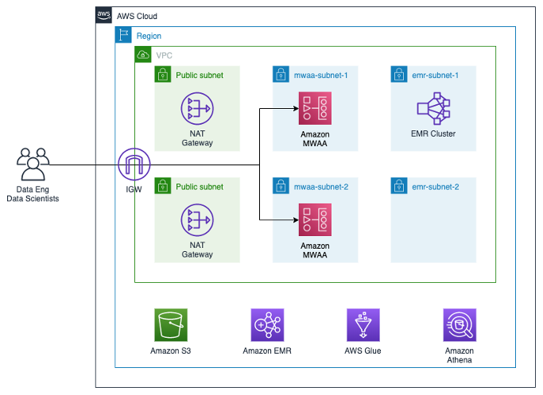
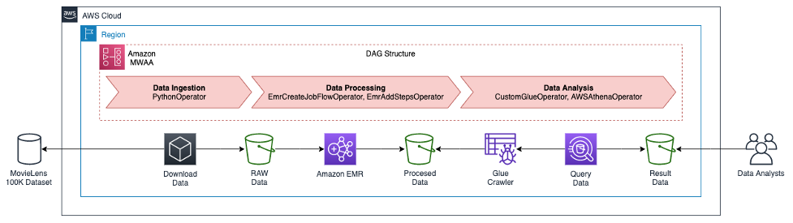
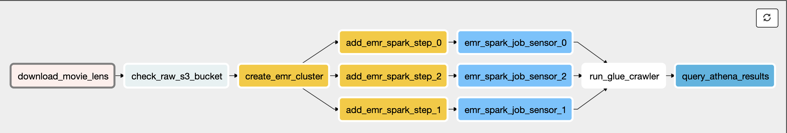

# Amazon MWAA Workflow Demo

This project contains the required services and DAGs to present an Amazon MWAA demo, such as: Amazon S3 Buckets, Amazon VPC (Subnets, NAT-GW and Routes), AWS Glue Crawler & Database and the required IAM roles to interoperate the services.
The project contains one Apache Airflow DAG with the required instructions and dependencies orchestrate the workflow. Lastly, it's included an PySpark script to process the source data set and transform the data leveraging Amazon EMR.

This project serves as a quick start environment to start using Amazon MWAA with integration to AWS Big Data Services, such as: Amazon EMR, Amazon Athena, AWS Glue, and S3.

This code sample is discussed in detail in this AWS [Blog Post](https://aws.amazon.com/es/blogs/aws-spanish/escalando-aplicaciones-de-reconocimiento-de-imagenes-con-amazon-rekognition/).

### Architecture

The AWS CDK Scrip contained in this repository deploys the following architecture.



### DAG Workflow

The DAG contained at this project deploys uses the Movie Lens data set to deploy the following data pipeline and will produce a summary table of the top 10 movie categories by average review score.





### Usage

#### Prerequisites

- An AWS Account 
- AWS CDK for Python
- AWS CLI configured with access creadentials
- Python 3.6+
- IAM Privileges to deploy and delete the components of the architecture:
    
    - Amazon MWAA
    - Amazon S3 Buckets
    - AWS IAM Roles and Policies
    - Amazon EMR Clusters
    - Amazon Athena
    - AWS Glue Crawler and Databases
    - Cloud9
    - AWS CloudFormation
    - AWS VPC
    
#### Deployment

1 - Create one Cloud9 Environment
    
    1.1 Search AWS Cloud9 Service in the AWS Console (us-east-1).
    1.2 Click on "Create Environment" 
    1.3 Enter Name environment of your preference
    1.3 Configure settings: Just click on Next button.
    1.4 Once the enviroment is deplyed. Click on "Open IDE"

2 - Clone the code in this repository. 

3 - Proceed with the following commands in the AWS Cloud9 Terminal. 

```
npm install -g aws-cdk
cd ~/environment/amazon-mwaa-workflow-demo
python3 -m venv .env
source .env/bin/activate
pip install -r requirements.txt
cdk bootstrap
cdk deploy --all
```

4 - Check that the AWS CDK Deployment completed successfully. Take note of the AWS CDK Outputs provided in the terminal which contains the Name and IDs of the resources used in this demo. 

5 - Run the Post Deployment script in the AWS Cloud9 Terminal to generate a JSON file containing the required Airflow Variables

```
cd ~/environment/amazon-mwaa-workflow-demo/post_scripts
python3 CreateMWAAVariables.py
```

6 - Check in the "~/environment/amazon-mwaa-workflow-demo/post_scripts" folder the existence of the "mwaa_demo_variables.json" file

7 - Create a Amazon MWAA Environment

    7.1 Search for Amazon MWAA service in the AWS Console.
    7.2 Click Create Environment
    7.3 On "Environment Details", enter the Name of your preference
    7.4 On "DAG code in Amazon S3 > S3 Bucket", click "Browse" and select the Amazon S3 bucket created by the AWS CDK Script with the following pattern *cdk-mwaa-s3-mwaaconfigXXXXXXX*
    7.5 On "DAG code in Amazon S3 > DAGs folder", click "Browse" and select the "dags" folder inside the Bucket. Leave the rest of the settings with the defaults values and click "Next"
    7.6 On "Networking > Virtual private cloud (VPC)", Select the VPC that matches the VPC-ID provided in the CDK Output
    7.7 On "Networking > Subnet 1 and Subbnet 2", Select the Subnets that matches the *cdk-mwaa-vpc.mwaasubnetid1* and *cdk-mwaa-vpc.mwaasubnetid2* respectively provided in the CDK Output
    7.8 On "Networking > Web server access", Select "Public network (No additional setup)", and ensure that "Create new security group" is checked.
    7.7 Leave the rest of the parameters with the defaults values. Click "Next", and then click "Create Environment"
    7.8 Click on the new environment and search for the "Execution Role". Click on the role name, you'll be re-directed to the IAM Role configuration. Click on "Attach Policy", search for the  *mwaa_airflow_policy* policy, select it and click "Attach"
    7.9 Return to the Amazon MWAA Service Console. Wait for the deployment to complete, click in the newly created environment name, search and click the Airflow User Interface link
    
8 - Load Airflow Variables and Trigger the "mwaa_blogpost_data_pipeline" DAG
    
    8.1 In the Airflow Web Server Interface, Click in the top panel "Admin > Variables", proceed to load the JSON file generated in step 5
    8.2 Return to the DAGs pannel, Click on the *mwaa_blogpost_data_pipeline* Dag and proceed to inspect the "Tree View" and "Graph View" of the DAG
    8.3 Enable the Dag by clicking on the "Off" icon in the top left. It will transition to "On" and one execution of the dag will be scheduled and executed.
    8.4 Inspect the transitions of the Dag, the Amazon S3 Buckets involved in the Data Pipelenie, Amazon EMR service (Cluster Creation and Termination), and AWS Glue Crawler.
    8.5 Finaly in the Aamazon S3 Bucket *datalake_processed_bucket/athena_results* you'll find the results of this data pipelinee in a CSV Format.

#### Cleanup

In order to delete all the components deployed by this solution and avoid additional charges:

1 - Reverse Step 7.8. Click on the new Amazon MWAA environment and search for the "Execution Role". Click on the role name, you'll be re-directed to the IAM Role configuration. Select  *mwaa_airflow_policy* policy, select it and click "Detech Policy"

2 - Delete the Amazon MWAA Environment, wait until the environment is successfully deleted

3 - Run the Post Deployment script in the AWS Cloud9 Terminal to delete the Security Groups created for the Amazon MWAA environment and Amazon EMR Cluster Instances (Master and Core). Monitor the Output of the Script for the successful completion.

```
cd ~/environment/amazon-mwaa-workflow-demo/post_scripts
python3 CleanUpScript.py
```

3 - Delete the AWS CDK Stack. In the AWS Cloud9 Terminal run the following commands. Monitor the terminal and enter "Y" when prompted about deleting the *cdk-mwaa-s3*, *cdk-mwaa-vpc*, and *cdk-mwaa-iam* stacks

```
cd  ~/environment/amazon-mwaa-workflow-demo
cdk destroy --all
```

### Making changes to the code and customization

The [contributing guidelines](CONTRIBUTING.md) contains some instructions about how to run the front-end locally and make changes to the back-end stack.

## Contributing

Contributions are more than welcome. Please read the [code of conduct](CODE_OF_CONDUCT.md) and the [contributing guidelines](CONTRIBUTING.md).

## Licensing

See the [LICENSE](LICENSE.txt) file for our project's licensing. We will ask you to confirm the licensing of your contribution.

We may ask you to sign a [Contributor License Agreement (CLA)](http://en.wikipedia.org/wiki/Contributor_License_Agreement) for larger changes.

